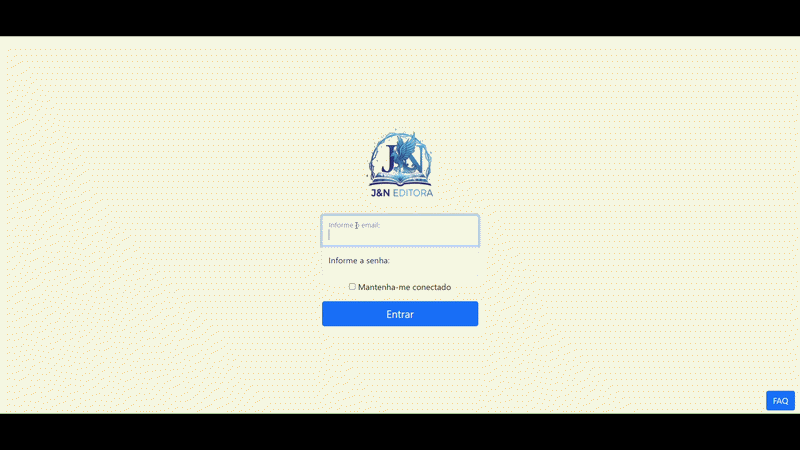
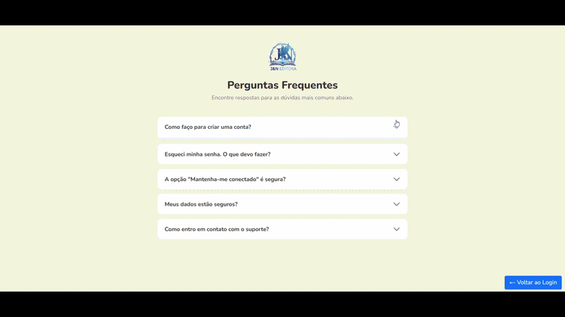

# Projeto - Tela de Login

  
  <h1 align="center"> Tela de Login - JN Editora </h1>

 

## Índice
1. [Descrição](#descrição)
2. [Atualizações](#atualizações)
3. [Funcionalidades](#funcionalidades)
4. [Ferramentas Utilizadas](#ferramentas-utilizadas)
5. [Demonstração da Aplicação](#demonstração-da-aplicação)
6. [Autores](#autores)

## Descrição

&emsp;&emsp; Projeto criado na aula da disciplina de programação Front-End, na unicesumar, campus de Londrina. O professor [Leonardo Rocha](https://github.com/leonardossrocha) introduziu os conceitos de framework, apresentando o Bootstrap e alguns exemplos disponíveis nesse framework, e git, realizando o passo-a-passo de configuração do ambiente de desenvolvimento. 
&emsp;&emsp; O Projeto Tela de Login é um projeto de interface web que simula uma tela de login, acompanhada de uma página de FAQ para auxiliar os usuários em caso de dúvidas durante o processo de login.

## Atualizações

🎨 Atualização Visual  
Foram realizados ajustes visuais na interface, promovendo uma aparência mais limpa e alinhada à identidade do projeto.

🌐 Adaptação do Template Bootstrap  
O template base do Bootstrap foi traduzido e adaptado do inglês para o português, garantindo consistência linguística em todos os componentes da interface.

🖼️ Logo Personalizada  
O projeto passou a contar com uma logo exclusiva, desenvolvida com auxílio de inteligência artificial, reforçando a identidade visual da aplicação.

❓ Botão de FAQ  
Foi adicionado um botão de acesso rápido ao FAQ na interface principal. Ao ser clicado, o usuário é redirecionado para uma tela dedicada de Perguntas Frequentes, melhorando o suporte e a navegabilidade.

## Funcionalidades

- **Validação de e-mail em tempo real:** Verifica se o endereço de e-mail inserido pelo usuário está em um formato válido antes de prosseguir com o login.
- **Página de FAQ:** Botão na tela de login que redireciona o usuário para uma página dedicada às perguntas frequentes, auxiliando na resolução de dúvidas relacionadas ao acesso.
- **Navegação intuitiva:** Na tela de FAQ, um botão de retorno permite voltar facilmente à tela de login.

## Demonstração da Aplicação

  <strong>Tela Principal - Login</strong>  
  </img>    
  <strong>Tela FAQ</strong>  
  </img>

## Ferramentas utilizadas

 &nbsp;  &nbsp;  &nbsp;&nbsp;  &nbsp; 

## Autores
[Nivea Sofia](https://github.com/niveasofia) &nbsp; &nbsp; [João Elias](https://github.com/joaoelias10)  
&nbsp; &nbsp;&nbsp;&nbsp;&nbsp;&nbsp; 